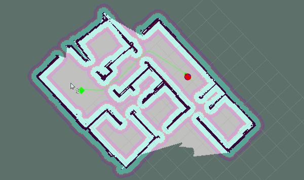

# Final Project - Home Service Robot

This repo contains the final project of the Robotics Software Engineer Nanodegree Program from Udacity. The program shows a home service robot which can perform SLAM (Simultaneous Localization and Mapping) using [gmapping](http://wiki.ros.org/gmapping). The mobile robot navigates autonomously from its initial position to the pickup point and then to a drop off point.

The image below shows the robot in gazebo simulator:

## Dependencies for Running
* cmake >= 3.5.1
  * Linux: [click here for installation instructions](https://cmake.org/install/)
* make >= 4.1 (Linux, Mac)
  * Linux: make is installed by default on most Linux distros
* gcc/g++ >= 5.4
  * Linux: gcc / g++ is installed by default on most Linux distros
* gazebo simulator >= 11.0.0
  * Linux: [gazebo download](http://gazebosim.org/download)
* ROS >= Kinetic
  *  Linux: [Ubuntu install of ROS Kinetic](http://wiki.ros.org/kinetic/Installation/Ubuntu)

## Basic Running Instructions

1. Clone this repo.
2. Open top level directory: `cd RobotND-HomeServiceRobot/catkin_ws`
3. Build the files: `catkin_make`
4. Execute in terminal: `source devel/setup.bash`
5. Run the simulation file located in the scripts folder: `./src/script/home_service.sh` (this file must have execution permission)

There are other options for testing:
* `test_slam.sh`: Allows to generate the map through navigation of the robot with keyboard commands (`RobotND-HomeServiceRobot/catkin_ws/src/teleop_twist_keyboard/teleop_twist_keyboard.py` must have execution permission)
* `test_navigation`: Show only Adaptive Monte Carlo Localization (ACML)
* `test_navigation_to_goal`: The robot navigates in the map with a goal indicated in Rviz (2D Nav Goal tool)
* `test_markers:` Shows a cube object in the map
